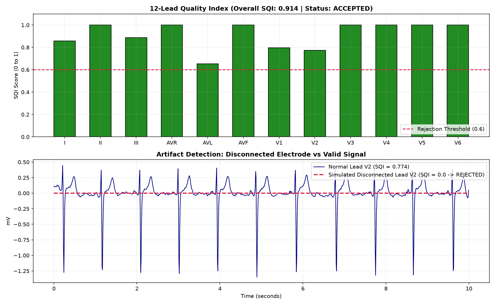
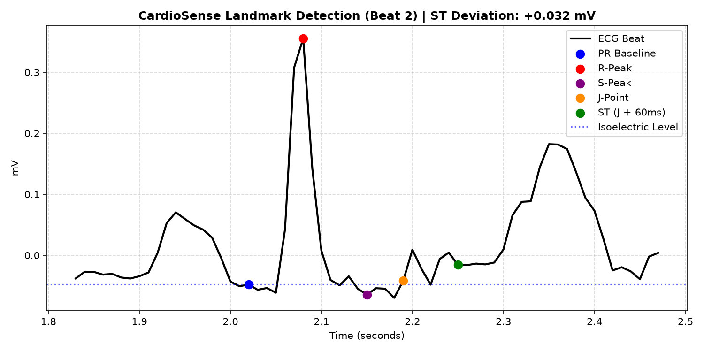

# CardioSense — Engineering & Verification Log

**System**: Prototype Clinical Decision-Support System for Myocardial Infarction & Ischemia Detection  
**Target Inputs**: 12-lead ECG (PTB-XL, 100 Hz) / Single-lead ESP32 sensor  
**Architecture**: Dual-model (Interpretable Clinical Features + 1D-CNN) with SQI Quality Control & Grounded LLM Triage  

---

## Phase 1: Foundation, Data Ingestion & Signal Quality Control

### 1.1 Environment & Setup
- **Stack**: Python, SciPy (DSP), PyTorch (DL), Pandas, WFDB.
- **Virtual Environment**: Isolated `.venv` with `.gitignore` rules preventing raw dataset commits.
- **Repository**: Git initialized with Conventional Commit standards.

---

### 1.2 Data Ingestion & Inspection
- **Source**: PTB-XL Clinical Dataset (PhysioNet v1.0.3).
- **Module**: `src/data/download_ptbxl.py`
  - Automated downloader for `ptbxl_database.csv` (21,837 annotated clinical records).
  - Fetched representative samples across diagnostic classes: `NORM`, `MI`, `STTC`.
- **Verification Test**: `tests/test_inspect_ecg.py`
  - Loaded Record ID 1 (Patient: Normal Sinus Rhythm).
  - Shape: 1000 samples × 12 leads (10.0 seconds at 100 Hz).
  - **Clinical Finding**: Raw waveforms exhibited low-frequency baseline wander (0.1–0.5 Hz) from respiration and high-frequency muscle tremor.

---

### 1.3 Digital Signal Processing (DSP) & Noise Filtering
- **Module**: `src/dsp/filters.py`
- **Design**:
  - **Butterworth Bandpass (0.5 Hz – 40.0 Hz, 3rd Order)**:
    - High-pass (0.5 Hz) removes respiration baseline drift without distorting ST segments.
    - Low-pass (40 Hz) eliminates somatic tremor (muscle jitter) and high-frequency noise.
  - **Zero-Phase Filtering (`scipy.signal.filtfilt`)**: Forward-backward filtering guarantees zero phase shift (0 ms time delay), preserving P-Q-R-S-T landmark timings.
- **Verification Test**: `tests/test_filters.py`
  - Cleaned Lead II and Lead III: undulating baseline was flattened to a stable 0.0 mV isoelectric line.

---

### 1.4 Signal Quality Index (SQI) & Artifact Rejection
- **Module**: `src/dsp/sqi.py`
- **Clinical Rationale**: Rejects corrupted leads or unattached electrodes before feeding signals into AI models, preventing false alarms.
- **Metrics Evaluated**:
  1. **Flatline Detection**: Rejects near-zero variance ($\sigma^2 < 10^{-4}$).
  2. **Clipping / Saturation**: Rejects leads with $>5\%$ samples stuck at hardware bounds.
  3. **Kurtosis & Energy Ratio**: Normal QRS bursts exhibit peaked kurtosis ($2 \le k \le 15$).
- **Verification Test Results (`tests/test_sqi.py`)**:
  - **Test 1 (Real Clinical 12-lead ECG)**: Overall SQI: `0.914` (Passed 12/12 leads, Accepted).
  - **Test 2 (Simulated Disconnected Lead V2)**: Lead V2 Quality Score: `0.000` (Instant Rejection).

---

## Phase 2: Interpretable Clinical Feature Extraction

### 2.1 R-Peak Detection & Heart Rate Variability (HRV)
- **Module**: `src/features/r_peaks.py`
- **Algorithm**:
  - Derivative & squaring energy transform: amplifies steep QRS slopes, suppresses P/T waves.
  - Adaptive thresholding (30% of 98th percentile energy) with a 250 ms physiological refractory lockout.
- **Verification Test Results (`tests/test_r_peaks.py`)**:
  - Record ID 1 (Lead II):
    - Detected Beats: `11 beats`
    - Heart Rate: `63.9 BPM` (Normal resting range)
    - Mean RR Interval: `0.939 s`
    - SDNN: `18.1 ms`
    - RMSSD: `24.9 ms`

---

### 2.2 Fiducial Landmarking & ST-Segment Deviation
- **Module**: `src/features/fiducials.py`
- **Clinical Landmarks Measured**:
  - PR baseline (isoelectric reference level).
  - R-peak and S-peak.
  - J-point (junction between S-wave and ST-segment).
  - ST-deviation voltage measured at $J + 60\text{ ms}$ across all 12 leads.
  - QRS duration (ms).
- **Verification Test Results (`tests/test_fiducials.py`)**:
  - Record ID 1 (`NORM` patient):
    - Estimated QRS Duration: `170.0 ms`
    - Max ST Elevation: `+0.093 mV` (Within non-ischemic threshold < 0.1 mV)
    - Max ST Depression: `-0.020 mV`
    - Individual leads centered tightly around 0.00 mV (e.g. Lead I: -0.008 mV, AVR: +0.001 mV, V5: +0.007 mV).

