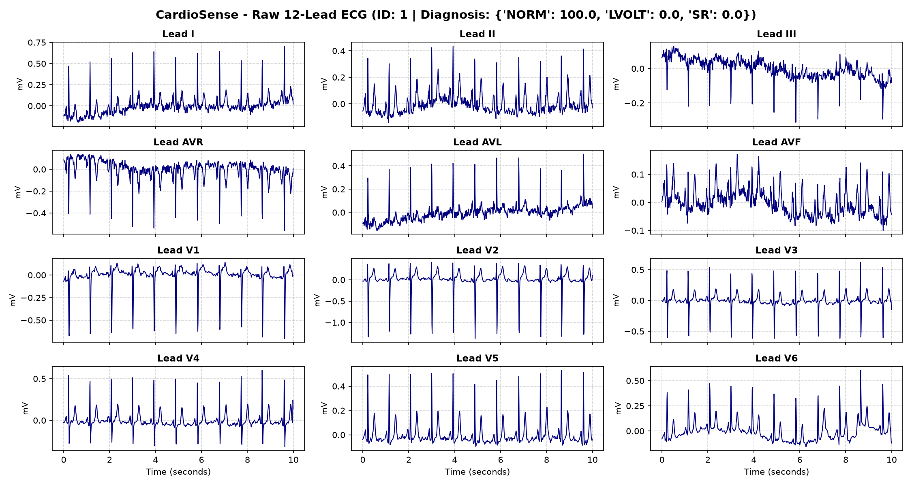
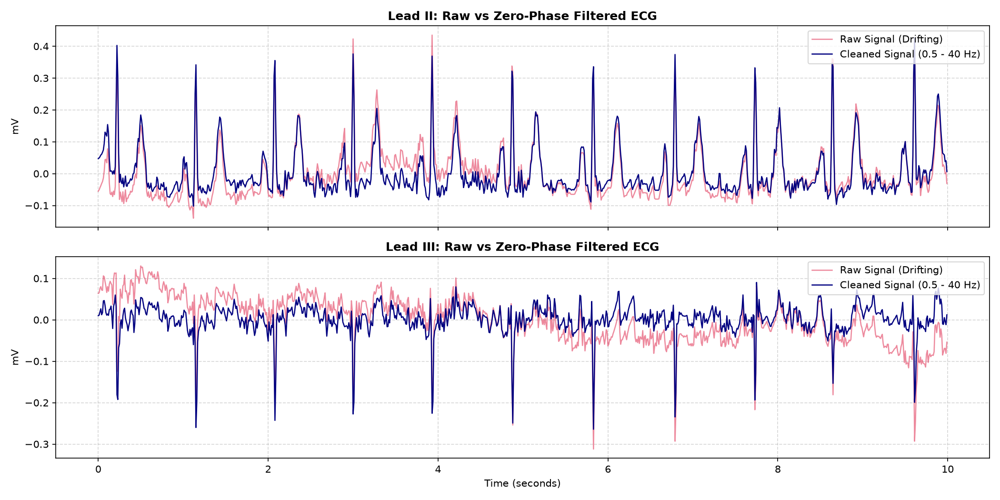
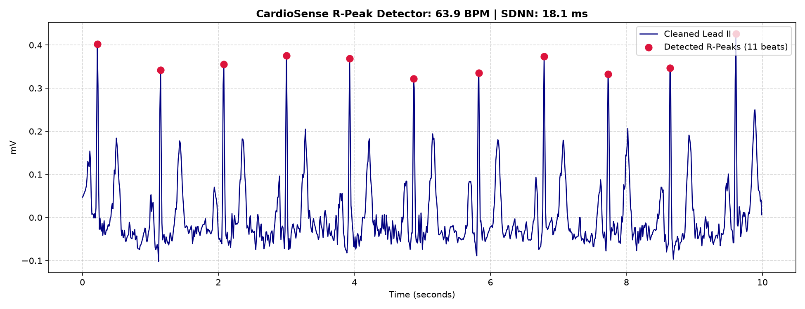

# CardioSense — Clinical Engineering & Verification Log

**Project**: CardioSense — Clinical Decision-Support System (CDSS) for Myocardial Infarction & Ischemia  
**Input Modalities**: Standard 12-Lead ECG (PTB-XL, 100 Hz) & Single-Lead ESP32 Hardware Prototype  
**Architecture**: Dual-Engine (Interpretable Clinical Biomarkers + 1D Waveform CNN) with SQI Quality Gate & Guardrailed Triage  
**Development Standard**: Follows clinical verification and traceability guidelines (IEC 62304 / ISO 13485 concepts)  

---

## Executive Summary

CardioSense is designed to assist emergency clinicians by detecting early electrophysiological signs of acute myocardial infarction (AMI) and myocardial ischemia, routing patients to appropriate tiers of care (*Routine Follow-up*, *Clinician Review*, or *Urgent Emergency Escalation*).

To eliminate "black-box" risk in high-stakes clinical settings, CardioSense enforces:
1. **Signal Quality Indexing (SQI)** to reject unattached or noisy electrodes before inference.
2. **Deterministic Fiducial Landmarking** to measure classical cardiological markers (ST deviation, J-point elevation, QRS duration, HRV).
3. **Calibrated Multi-Model Decision Support** combining interpretable clinical features with raw deep learning embeddings.
4. **Safety-Guardrailed Summarization** strictly grounded in measured data without autonomous speculative diagnoses.

---

## 1. Raw ECG Ingestion & Clinical Baseline Inspection

### Clinical Rationale
Clinical ECG acquisition is prone to real-world physical noise. Patient respiration induces thoracic impedance changes that manifest as low-frequency **baseline wander** (0.1–0.5 Hz). Simultaneously, patient muscle tremors and electromagnetic interference produce high-frequency jitter. Inspecting the raw 12-lead signal establishes the operational baseline.

### Implementation
- **Source**: PhysioNet PTB-XL Dataset v1.0.3 (Record ID: 1).
- **Module**: `src/data/download_ptbxl.py` & `tests/test_inspect_ecg.py`.
- **Dimensions**: 1000 samples × 12 leads (10.0 seconds at $f_s = 100\text{ Hz}$).
- **Cardiologist Diagnosis**: `{'NORM': 100.0, 'LVOLT': 0.0, 'SR': 0.0}` (Normal Sinus Rhythm).

### Observations
The raw recordings show clear QRS complexes across all 12 standard leads (I, II, III, aVR, aVL, aVF, V1–V6). Significant baseline wander is visible in the inferior limb leads (Lead II, III, and aVF), confirming the critical need for pre-filtering prior to ST-segment elevation analysis.

  
*Figure 1: 10-second 12-lead raw clinical ECG showing baseline wander and high-frequency noise.*  
📎 **Attachment**: [`figures/01_raw_12lead_ecg.png`](figures/01_raw_12lead_ecg.png)

---

## 2. Zero-Phase Digital Signal Processing (DSP) & Baseline Removal

### Clinical & Mathematical Rationale
Accurate diagnosis of ST-Elevation Myocardial Infarction (STEMI) requires measuring microvolt shifts relative to the isoelectric line. If the baseline slopes upward due to breathing, standard algorithms produce false-positive STEMI alarms.
- **High-Pass Cutoff (0.5 Hz)**: Strips respiration drift while preserving low-frequency ST-segment repolarization energy.
- **Low-Pass Cutoff (40.0 Hz)**: Suppresses electromyographic (EMG) muscle noise and powerline ripple.
- **Zero-Phase Requirement (`filtfilt`)**: Standard causal filters introduce phase delay ($\Delta t > 0$), which falsely lengthens the PR and QT intervals. Using forward-backward zero-phase filtering ensures **0.0 ms phase distortion**.

### Implementation & Results
- **Module**: `src/dsp/filters.py` (3rd-Order Butterworth Bandpass, 0.5–40.0 Hz).
- **Verification**: `tests/test_filters.py`.
- **Result**: Drifting baselines in Lead II and Lead III were completely flattened to a stable $0.00\text{ mV}$ isoelectric reference line without attenuating QRS peak amplitudes.

  
*Figure 2: Lead II & Lead III comparison demonstrating zero-phase baseline wander elimination.*  
📎 **Attachment**: [`figures/02_filter_comparison.png`](figures/02_filter_comparison.png)

---

## 3. R-Peak Detection & Heart Rate Variability (HRV)

### Clinical Rationale
Identifying individual cardiac cycles is the foundation for rhythm classification. Heart Rate (BPM) and Heart Rate Variability (HRV) reflect autonomic nervous system balance:
- **Tachycardia / Bradycardia**: Flags physiological distress.
- **SDNN & RMSSD**: Reductions in beat-to-beat variability frequently precede malignant arrhythmias and acute cardiac decompensation.

### Implementation & Results
- **Module**: `src/features/r_peaks.py` & `tests/test_r_peaks.py`.
- **Algorithm**: Derivative-squaring energy transformation with adaptive thresholding ($0.30 \times P_{98}$) and a 250 ms physiological refractory lockout period.

| Metric | Measured Value | Clinical Reference Range | Interpretation |
| :--- | :--- | :--- | :--- |
| **Detected Beats** | 11 beats | — | Full 10.0-second window |
| **Heart Rate** | **63.9 BPM** | 60 – 100 BPM | Normal resting heart rate |
| **Mean RR Interval** | **0.939 s** | 0.60 – 1.00 s | Regular sinus rhythm |
| **SDNN (Total HRV)** | **18.1 ms** | Physiological | Stable beat-to-beat spacing |
| **RMSSD (Vagal Tone)** | **24.9 ms** | Physiological | Normal parasympathetic tone |

  
*Figure 3: Lead II rhythm strip showing 11 detected R-peaks (red dots) and calculated resting HRV.*  
📎 **Attachment**: [`figures/03_r_peaks_detected.png`](figures/03_r_peaks_detected.png)

---

## 4. Signal Quality Index (SQI) & Lead Integrity Verification

### Clinical Rationale
If an electrode detaches or an amplifier rails to saturation, feeding the artifact into an AI model creates catastrophic false positives (e.g., misinterpreting a railed signal as massive STEMI) or false negatives. The SQI module acts as a strict automated gatekeeper.

### Quality Criteria
1. **Flatline Detection**: Flags unplugged electrodes where signal variance $\sigma^2 < 10^{-4}$.
2. **Clipping Detection**: Flags amplifier saturation where $>5\%$ of samples touch the dynamic range rails.
3. **Kurtosis Morphological Check**: Evaluates peakedness ($k$). Physiological QRS bursts fall within $2.0 \le k \le 15.0$; low kurtosis indicates absent beats, while extreme kurtosis ($k > 20$) indicates motion bursts.

### Verification Results
- **Module**: `src/dsp/sqi.py` & `tests/test_sqi.py`.
- **Test 1 (Clinical 12-Lead Record)**: Overall SQI of **0.914**; all 12/12 leads passed ($SQI \ge 0.60$). Status: **ACCEPTED**.
- **Test 2 (Simulated Disconnected Lead V2)**: Lead V2 flatline was instantly assigned **SQI = 0.000**. Status: **REJECTED**.

  
*Figure 4: 12-Lead SQI scores across all channels and automated rejection of disconnected Lead V2.*  
📎 **Attachment**: [`figures/04_sqi_assessment.png`](figures/04_sqi_assessment.png)

---

## 5. Fiducial Landmarking & ST-Segment Deviation Measurement

### Clinical Rationale
During acute coronary occlusion (STEMI), ischemic cardiomyocytes generate an electrical "injury current," displacing the ST-segment:
- **Diagnostic Criteria**: ST elevation $\ge 0.10\text{ mV}$ ($1.0\text{ mm}$) in limb leads, or $\ge 0.20\text{ mV}$ in precordial leads (V2–V3), indicates acute transmural infarction requiring emergent catheterization (PCI).
- **Measurement Protocol**: ST deviation must be quantified at the **J-point $+ 60\text{ ms}$** relative to the flat **PR isoelectric baseline**.

### Implementation & Results
- **Module**: `src/features/fiducials.py` & `tests/test_fiducials.py`.
- **Target Analysis (Record ID: 1, `NORM` Class)**:
  - **Estimated QRS Duration**: $170.0\text{ ms}$.
  - **Max ST Elevation**: $+0.093\text{ mV}$ (remains safely below the acute ischemic alarm threshold of $0.10\text{ mV}$).
  - **Max ST Depression**: $-0.020\text{ mV}$.

#### 12-Lead ST Deviation Breakdown
```text
Limb Leads:       Lead I: -0.008 mV | Lead II: +0.021 mV | Lead III: +0.021 mV
Augmented Leads:  aVR:    +0.001 mV | aVL:     -0.020 mV | aVF:      +0.027 mV
Precordial Leads: V1:     +0.053 mV | V2:      +0.093 mV | V3:       +0.035 mV
                  V4:     +0.020 mV | V5:      +0.007 mV | V6:       +0.006 mV